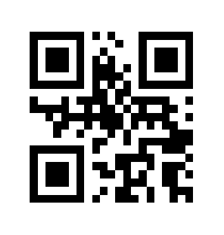

# qr

QR Code encoder written in Zig. See it in action here: [bensengupta.github.io/qr](https://bensengupta.github.io/qr/)

## Usage

```
$ qr --error M "Hello world"
```



## Options

```
$ qr --help

Usage: qr [options] <message>

QR Code options:
  -e, --error     Error correction level       ["L", "M", "Q", "H"]
  -q, --qzone     Quiet zone size                         [integer]

Options:
  -h, --help      Show help

Examples:
  qr "some text"
  qr -e H "some text"
```

## Requirements

- Zig 0.12+

## Run

```
$ zig build
$ ./zig-out/bin/qr "Hello world"
```

## WebAssembly

```
$ zig build wasm
$ cp ./zig-out/qr.wasm web/
```

## References

- [ISO/IEC 18004:2015 QR Code bar code symbology specification](https://www.iso.org/standard/62021.html)
- [Reed-Solomon codes for coders](https://en.wikiversity.org/wiki/Reed%E2%80%93Solomon_codes_for_coders)
- [node-qrcode](https://github.com/soldair/node-qrcode)

## License

[MIT](./LICENSE.md)

The word "QR Code" is registered trademark of:
DENSO WAVE INCORPORATED

